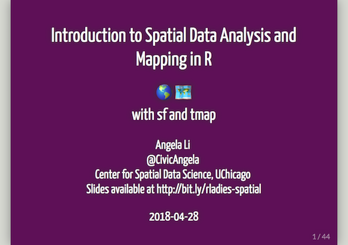

# Introduction to Spatial Data Analysis and Mapping in R 🌎

I gave a talk to R-Ladies Chicago on April 26, 2018 about cool new things in [#rspatial](https://twitter.com/search?q=%23rspatial), like the `sf` and `tmap` packages. Here are the slides from the Meetup - let me know if there are any typos or things I need to fix.

I'd also like to start building the #rspatialladies community, so stay tuned for more regarding this (and reach out if you're interested in helping organize). Expect a Slack channel sometime soon.

References
=================
Thank you to Alison Hill for awesome [R-Ladies presentation slides](https://github.com/rladies/resources/blob/master/xaringan-slides/how_to_use.Rmd). These are a great resource if you're interested in speaking at a R-Ladies Meetup in the future.

Big thanks also to Jakub Nowosad for [great intro slides on R for GIS](https://nowosad.github.io/presentations). I went through these for inspiration, but I learned a lot from doing so.

Check out the forthcoming [Geocomputation with R](https://geocompr.robinlovelace.net) book for more details about this spatial stuff.

Here's the documentation for [sf](https://r-spatial.github.io/sf/) and for [tmap](https://github.com/mtennekes/tmap) in case you're interested in a deeper dive.

Get in contact
=================
Find me on Twitter [@CivicAngela](https://twitter.com/CivicAngela) and email me at angela [at] rladies.org!
