```{r setup, include=FALSE}
options(htmltools.dir.version = FALSE)
```

# Three parts to this talk:

## 1. Why spatial data in R?

## 2. A quick tutorial

## 3. Some thoughts on the future of #rspatial

---

class: inverse, center, middle

# Why spatial data in R?

---

class: inverse

# I had to make a map for a class

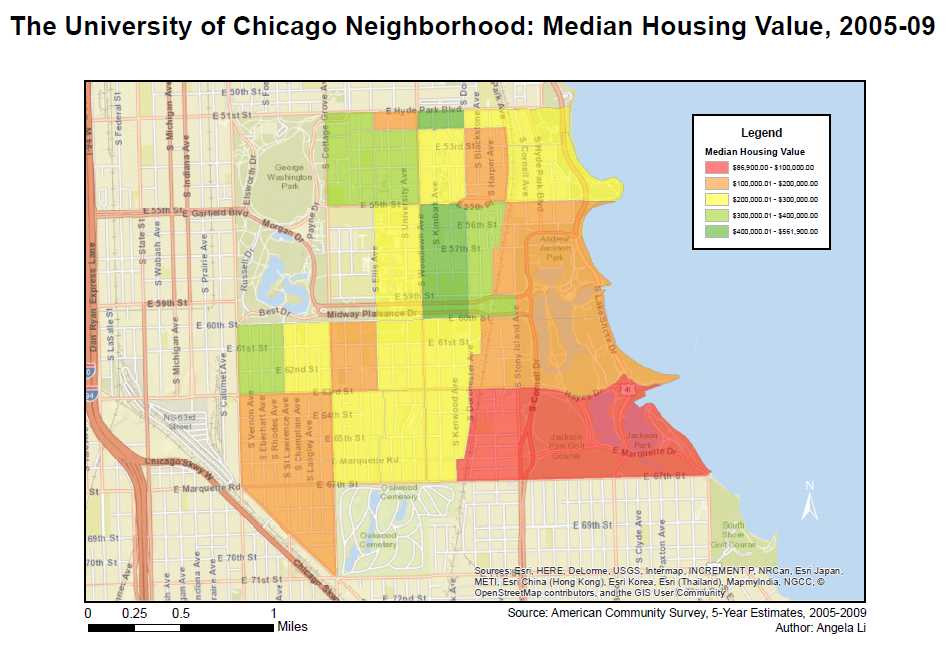
---
# Here's how you do it with a traditional GIS

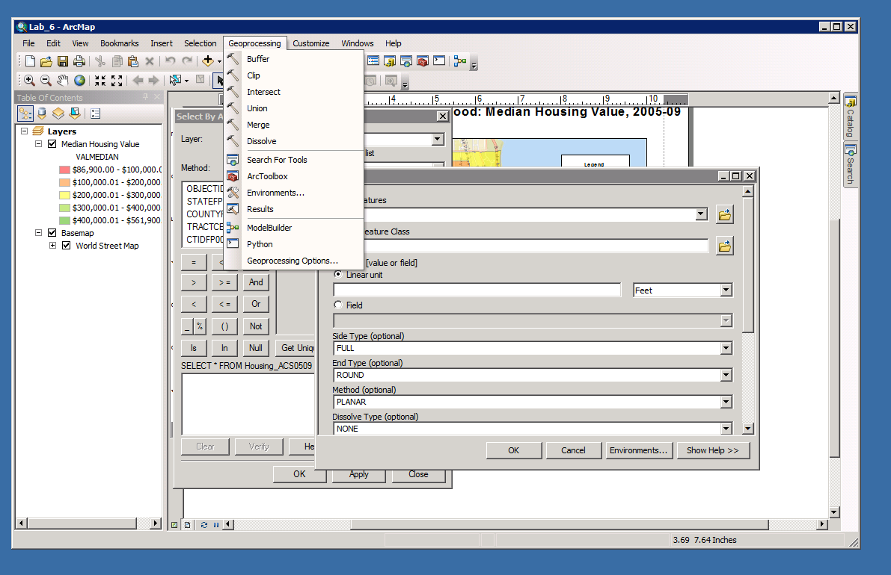

---

# This is fine, until

--

👎 You want to remake your map with a slightly different set of data and have to redo everything

--

👎 You want to make a bunch of maps quickly

--

👎 You forgot what buttons you even clicked to make the map

--

👎👎👎 **The GIS software crashes!**

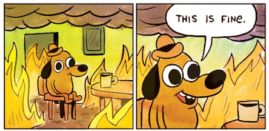

---

class: inverse, center, middle

# Enter R

## (and geographic data science)

---

# A map from my thesis

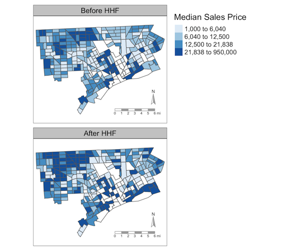

---

# And the code used to produce it

```{r eval=FALSE, tidy=FALSE}
library(tidyverse)
library(sf)
library(tmap)

sales <- read_csv("output/sales-tidy.csv")
tracts <- st_read("data/orig/shapefiles/detroit_tracts.shp")
tracts <- rename(tracts, tract = GEOID)

sales <- sales %>% 
  right_join(tracts, ., by = "tract") 

med_sales_map <- tm_shape(sales, unit = "mi") +
  tm_fill("med_price", palette = "Blues", breaks = quantile(a$med_price), title = "Median Sales Price") +
  tm_facets("after_hhf") +
  tm_shape(tracts) + 
  tm_borders() +
  tm_compass(fontsize = 0.6, color.dark = "dark grey") +
  tm_scale_bar(color.dark = "dark grey")

save_tmap(med_sales_map, "doc/figs/med_sales_map.png")
```

---

class: center, middle

# Not much code = pretty good results

Thanks, `sf` and `tmap`!


---

class: inverse, center, middle

# A quick tutorial 

---

# Getting started

Install the `sf` and `tmap` packages.

```{r eval=FALSE, tidy=FALSE}
install.packages("sf")
install.packages("tmap")
```

- `sf` stores spatial data as (tidyverse-friendly!) dataframes
  - `sp` is the original way to store spatial data in R, but it doesn't use dataframes
  - Many spatial statistics and mapping packages still rely on `sp`, so you'll probably encounter a `SpatialPolygonsDataFrame` at some point. 
  - No worries, you can convert from `sf` to `sp` and vice versa pretty easily
- `tmap` provides a quick way to make useful thematic maps and works directly with spatial objects
  - There are a bunch of other packages you can use to make interactive maps (`mapview`, `leaflet`, `ggplot2`, `shiny`), which I won't go into today

---

# Get some data

- You're looking for "shapefiles" but data with XY coordinates works too
- Many packages have been developed to acquire spatial data:
  - `spData`
  - `tidycensus`
  - `usaboundaries`
  - `osmdata`
  - etc. 
- If you have address data, you can geocode (translate addresses to latitude and longitude) with the `opencage` package, which I won't discuss today
- Check out all of these spatial packages later! 

---

# Let's download some data

## Support your [local open data portal](https://data.cityofchicago.org/)

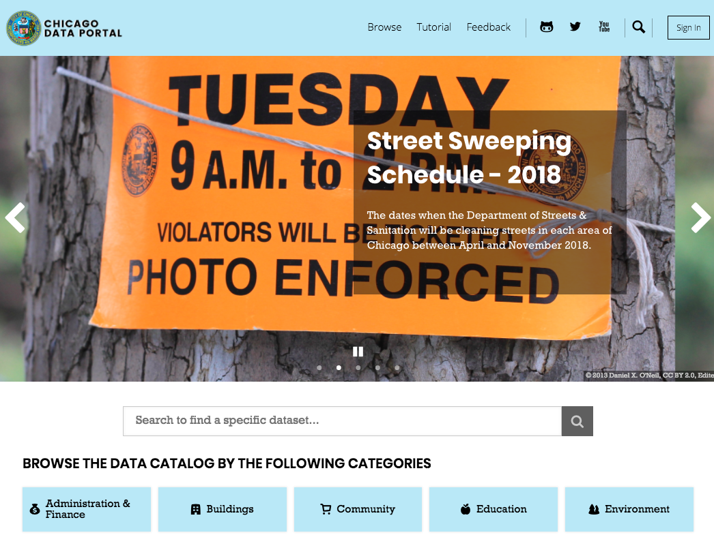
---

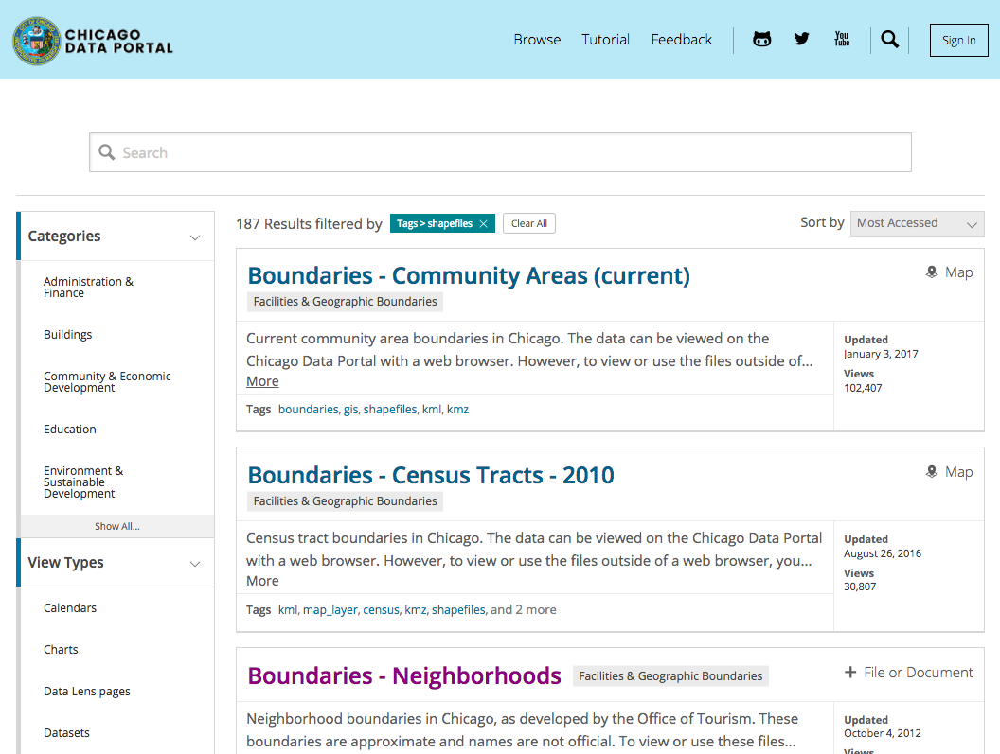

---

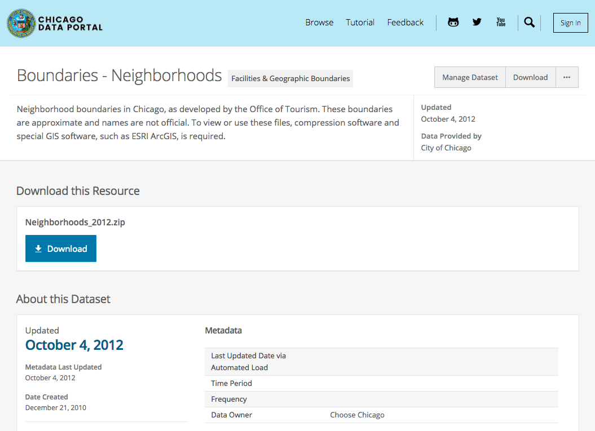

---

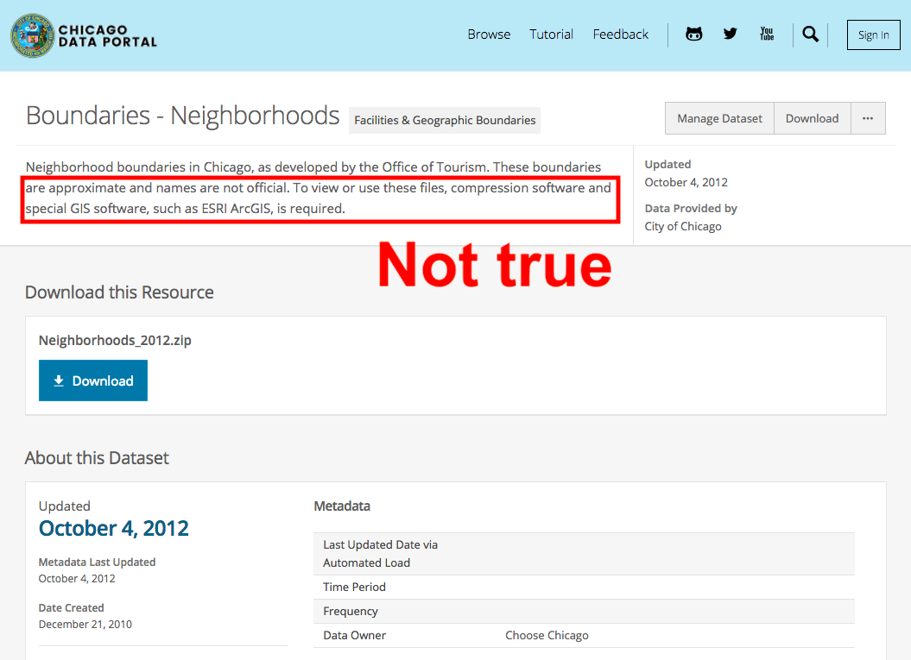

---

# You've downloaded the data

### What the heck are all of these files??

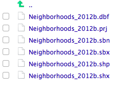

In general:
- .shp is the actual shape ("feature geometry") of the data
- .dbf represents the attributes associated with each shape
- .prj tells you how 3-D coordinates are "projected" into a 2-D map
- .sbn, .sbx, .shx are indexes that make it easier to work quickly with spatial data

FYI: spatial data tends to be BIG (because you have to store all the info about how to make the shapes!)
---

# Make your first map (1)

```{r warning=FALSE}
# Load package
library(sf)

# Read in shapefile
chi <- st_read("data/Neighborhoods_2012b.shp")
```
---

# Make your first map (2)
```{r}
# Map it using base R: just shape outlines
plot(st_geometry(chi))
```

---

# Make your first map (3)
```{r}
# This maps all the attributes
plot(chi)
```

---

class: inverse, middle

# Get more interesting data

Lots of great cleaned datasets at my research center's website to play with.

<center> https://geodacenter.github.io/data-and-lab/ </center>

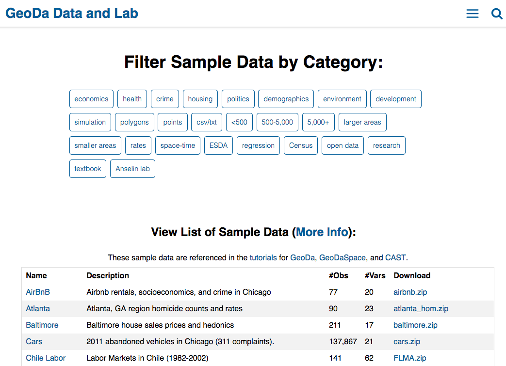

---

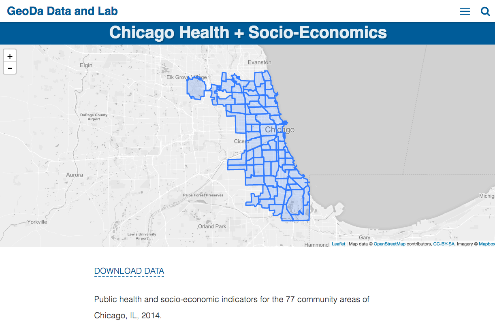

---

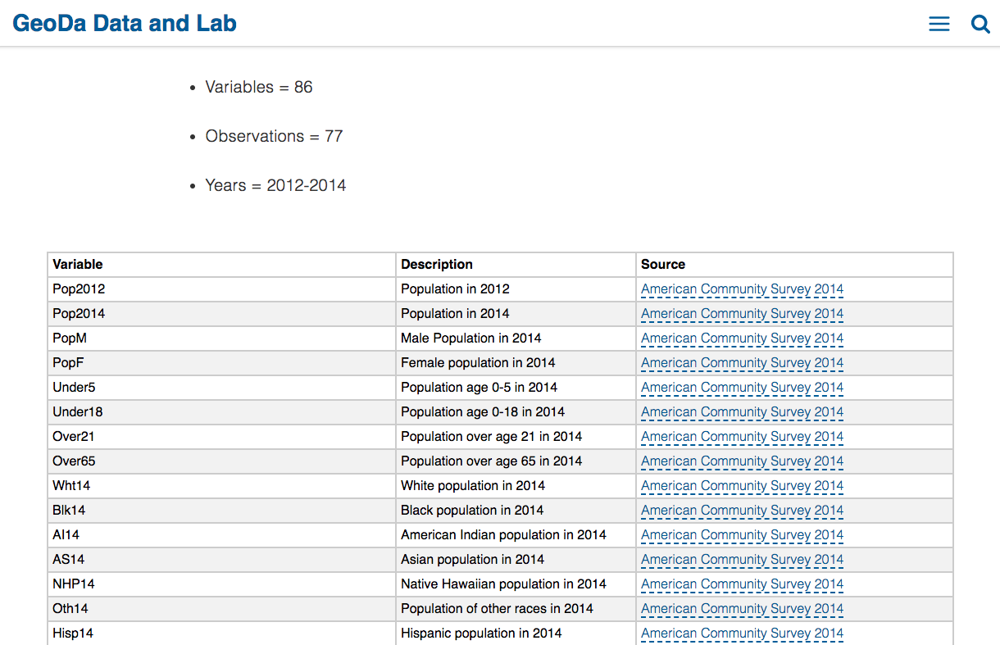

---

# Make a second map (1)

```{r}
chi2 <- st_read("data/ComArea_ACS14_f.shp")
```

For reference:
- `geometry type` describes the basic structure of the spatial data. You could have points, polygons, lines, and more.
- `bbox` gives the bounding box for the data, and can be used to crop other layers when you make a map.
- `epsg (SRID)` is a special code that indicates what projection is being used. When in doubt, `4326` is a good one.
- `proj4string` refers to the same thing as the EPSG code. If the string starts with `+proj=longlat`, that means your data is **unprojected**. 

---
# Make a second map (2)

Let's make a choropleth map of population by neighborhood!

```{r}
# Check what variables we have
names(chi2)
```

---
```{r}
# Map population by neighborhood
plot(chi2["Pop2014"])
```

---

# Use `tmap` to make a prettier map

```{r eval=FALSE}
library(tmap)
tm_shape(chi2) +
  tm_fill("Pop2014", palette = "Purples", 
          title = "Population by Neighborhood, 2014")
```

---
```{r echo=FALSE}
library(tmap)
tm_shape(chi2) +
  tm_fill("Pop2014", palette = "Purples", 
          title = "Population by Neighborhood, 2014")
```

---

class: inverse, center, middle

# Let's do some spatial analysis!

---

# How are grocery stores and population related?

Time to add a point layer with locations of grocery stores.

```{r warning=FALSE}
groceries <- st_read("data/groceries.shp")
```

Note that this is a `POINT` object, and that it has a projection: `+proj=tmerc` (Transverse Mercator). If we want to plot this in the same map as the neighborhood boundaries, we will need to make sure both files have the **same projection**.

⭐ This is a key source of frustration when working with spatial data. If some layers aren't showing up when you make a map, check that they all have the same projection! ⭐ 

---

# Project the neighborhood data

You generally project the data that has the `+proj=longlat` string, because it is initially **unprojected**.
```{r warning=FALSE}
# Get the CRS (coordinate reference system) of the groceries point data
groceries_crs <- st_crs(groceries)

# Project the neighborhood boundaries
chi2 <- st_transform(chi2, groceries_crs)
```
---

# Plot population and grocery stores

```{r eval=FALSE}
# Plot both
tm_shape(chi2) +
  tm_borders() + 
  tm_fill("Pop2014", palette = "Purples", 
          title = "Population by Neighborhood, 2014") +
  tm_shape(groceries) +
  tm_dots(title = "Groceries", size = 0.1, col = "black")
```

---

```{r echo=FALSE}
# Plot both
tm_shape(chi2) +
  tm_borders() + 
  tm_fill("Pop2014", palette = "Purples", 
          title = "Population by Neighborhood, 2014") +
  tm_shape(groceries) +
  tm_dots(title = "Groceries", size = 0.1, col = "black")
```

---

class: inverse, center, middle

# You can also use dplyr to perform analysis!

---

# Which neighborhoods in Chicago have the most grocery stores?

```{r message=FALSE}
library(dplyr)

chi2 %>% 
  st_join(groceries, .) %>% 
  group_by(community) %>% 
  tally() %>%
  arrange(desc(n))
```

---

# More advanced spatial analysis involves buffers, distance, intersections, etc.

Code from my thesis:
```{r eval=FALSE}
get_point_counts_in_buffer <- function(points_to_buffer, 
                                       points_to_intersect, 
                                       buffer_size = 500) {
  number_points_within_buffer <- points_to_buffer %>% 
    st_buffer(buffer_size) %>% 
    st_contains(points_to_intersect) %>% 
    map_dbl(length) %>% 
    tibble(pts_in_buffer = .)
  
  return(number_points_within_buffer)
}
```

---
# And what it did:

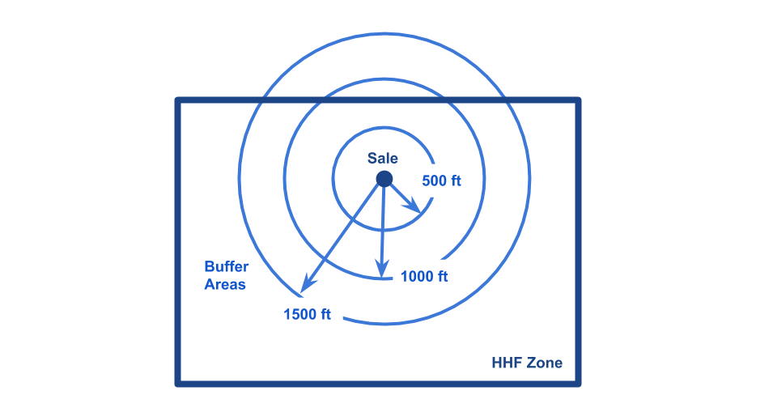

---

class: inverse, middle, center

# Now a few words on the future of #rspatial

---

class: inverse, middle, center

# IT NEEDS MORE WOMEN

---

# 1. Submitting issues

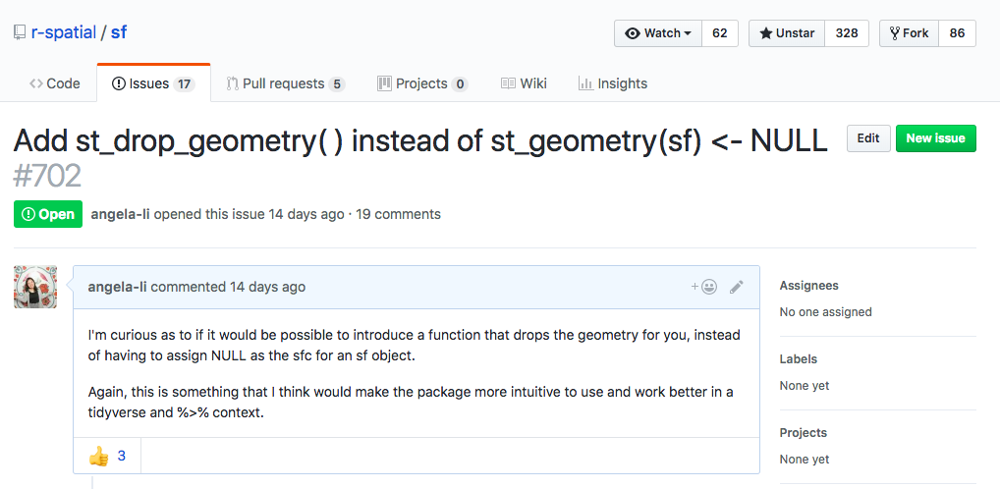
---

# 2. Building communities


---

class: center, inverse, middle

# 3. Getting our voices out there!

## Stay tuned for more...

---

class: center, middle

# Thanks!

Slides created via the R package [xaringan](https://github.com/yihui/xaringan) by [Yihui Xie](https://twitter.com/xieyihui?lang=en) with the [Rladies](https://alison.rbind.io/post/r-ladies-slides/) theme by [Alison Hill](https://twitter.com/apreshill).

Slides available at  <font style="text-transform: lowercase;"><http://bit.ly/rladies-spatial></font> <br>

Contact me at @[CivicAngela](https://twitter.com/CivicAngela), angela@rladies.org
